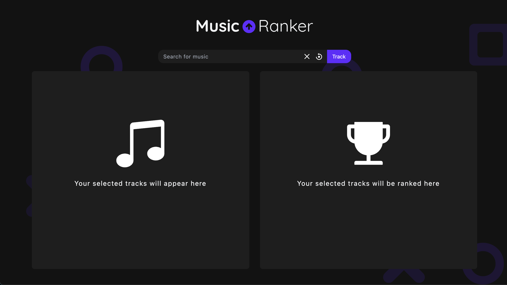
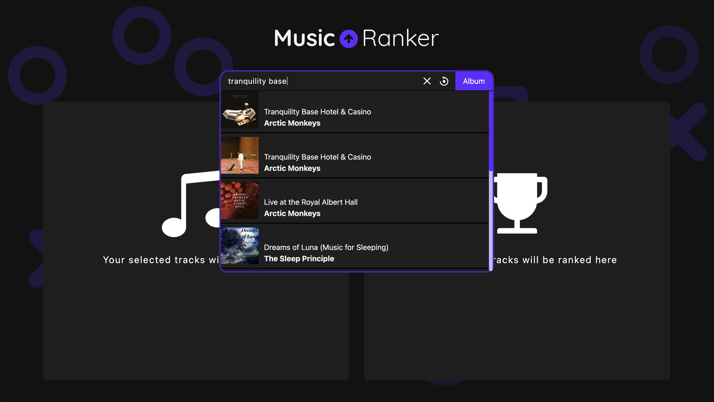
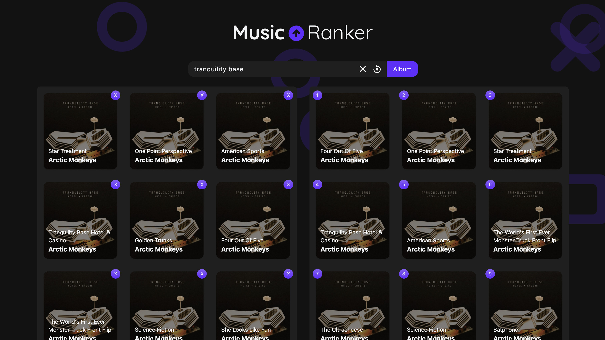

# Music Ranker

Music Ranker is a small webapp I built using React in which you can input an arbitrary number of songs and they will be ranked based on popularity. Also, in case you'd like to use an album as an input you can do so as well and it will actually add every song of that album and rank them accordingly.

You can see the final result [here](https://music-ranker.netlify.app/), but as this webapp is using [Deezer's API](https://developers.deezer.com/api) to obtain its data, it can stop working anytime, so take that into account.

## What problem does this solves?

When discovering new music sometimes the amount of songs to listen to can feel overwhelming, this webapp aims to solve this by letting you enter all these songs and giving you an idea of which one are the most popular, which does not neccessarily mean that they are the best ones among the group, but can be a good metric to take into consideration.

## An Example

In the following example I will be looking for the album _Tranquility Base Hotel & Casino_ by Arctic Monkeys and after selecting it we can see how the webapp ranks all the songs in the album.

---

## What was used

As previously mentioned, the data obtained for this project is fetched from [Deezer's API](https://developers.deezer.com/api). The webapp itself is built with React and the styles have been done using TailwindCSS.